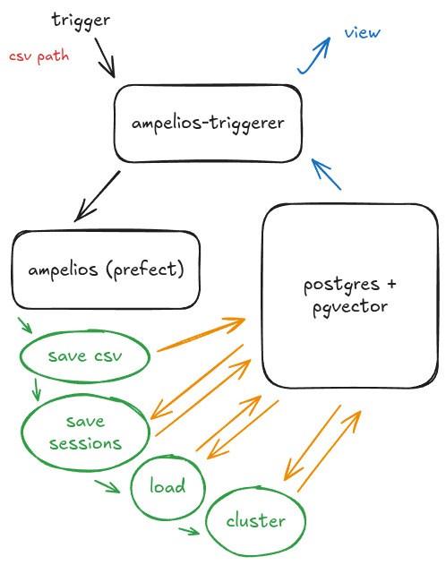

# Architecture

⚡ The pipeline is idempotent: you can safely run it repeatedly. Each batch of journeys is marked as processed in the database, so only new or unclustered journeys are picked up in subsequent runs.

**Target Architecture:** In production, the CSV ingestion job would be replaced by a Kafka or similar consumer streaming raw browser events. This would allow real-time incremental processing, while retaining the idempotent batch handling and clustering logic described above.
